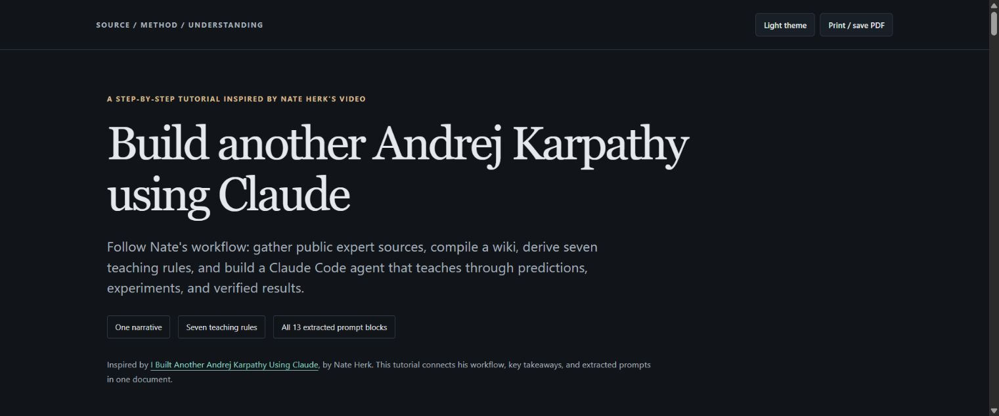

# From Nate Herk's Karpathy workflow to reusable expert skills

We started by turning Nate Herk's Karpathy demonstration into a step-by-step tutorial. We then created **`build-expert-workflow`**, a reusable skill for extracting a named expert's documented methods for a bounded task. We used that builder to create **`feynman-harmonic-oscillator`**, explained its creation in a second tutorial, and produced a worked oscillator lesson using the resulting skill.

The intention is to make expert-method “cloning” reusable across topics: build an assistant guided by observable methods, source support, and task-specific checks. A successful package does not establish that it reproduces an expert's mind or judgment. Feynman fidelity and comparative learning benefit remain unmeasured.

## Read the progression as live web pages

These links open rendered HTML on GitHub Pages, rather than HTML source in GitHub's file viewer.

| Step | Live page | What it shows |
| --- | --- | --- |
| 1. Start with Nate's demonstration | [Karpathy workflow tutorial](https://az9713.github.io/karpathy-claude-workflow-tutorial/) | Nate's sequence, extracted prompts, teaching rules, timestamps and reproduction limits. |
| 2. Generalize the workflow | [Build Expert Workflow guide](https://az9713.github.io/karpathy-claude-workflow-tutorial/expert-workflow-skill-guide.html) | How to invoke the builder, select sources, handle gaps, package methods and plan evaluation. |
| 3. Apply it to Feynman | [Feynman skill and evidence report](https://az9713.github.io/karpathy-claude-workflow-tutorial/skills/feynman-harmonic-oscillator/overview.html) | The resulting capability, source coverage, restrictions, gaps and evaluation status. |
| 4. Demystify the specialization | [How the Feynman skill was created](https://az9713.github.io/karpathy-claude-workflow-tutorial/feynman-skill-creation.html) | Each builder stage mapped to a concrete decision, plus source-to-instruction-to-test examples. |
| 5. Use the resulting skill | [Worked spring-oscillator lesson](https://az9713.github.io/karpathy-claude-workflow-tutorial/feynman-oscillator-example.html) | A prediction, numerical construction, exact solution, energy checks and transfer question. |

[](https://az9713.github.io/karpathy-claude-workflow-tutorial/)

The original tutorial brings the video's explanation, seven teaching rules, reusable prompts, and timestamp references into one self-contained web page. The later pages document our generalization and its Feynman application; those additions are our work, rather than content attributed to Nate's video.

## The two reusable skills

- [`build-expert-workflow`](skills/build-expert-workflow/SKILL.md) **builds task skills**. It audits sources and access, extracts conditional procedures with attribution, records contradictions and gaps, and specifies evaluations. It supports sparse evidence and requires no new interviews.
- [`feynman-harmonic-oscillator`](skills/feynman-harmonic-oscillator/SKILL.md) **performs a bounded teaching task**. It applies methods inferred from Feynman's edited lectures to classical linear oscillators, with selected extensions to damping, driving and circuits.

The builder creates the package; a future assistant reads the generated skill when teaching. This changes instructions and reference material, not model weights. The generalization does not prescribe Karpathy's seven rules for every expert.

These `skills/` folders are portable source packages. They are not automatically installed by cloning the repository. Use the [builder's installation and direct-file instructions](https://az9713.github.io/karpathy-claude-workflow-tutorial/expert-workflow-skill-guide.html#setup), or ask an assistant to read a package's `SKILL.md` and its references directly.

## Inspiration

This project is inspired by Nate Herk's video, **[I Built Another Andrej Karpathy Using Claude](https://www.youtube.com/watch?v=bvGptCLDhyo)**. The workflow and demonstrated prompts come from his video. This project organizes them into a written tutorial with explanations and source limitations.

“Build another Andrej Karpathy” is the video's framing for an agent guided by methods distilled from public sources. The workflow builds a source-backed wiki and teaching instructions; it does not describe training new model weights or transferring a person's mind.

## Nate's original demonstrated workflow

Open the [live tutorial](https://az9713.github.io/karpathy-claude-workflow-tutorial/) and work through the prompts in order:

1. **Gather the evidence.** Collect public blogs, repositories, lecture captions, and posts into an unchanged raw-source folder. Record files, word counts, and retrieval failures. [Video: 02:48](https://www.youtube.com/watch?v=bvGptCLDhyo&t=168s)
2. **Compile a wiki.** Create source pages, principles, methods, an index, a log, and a compact hot page. Link claims to their supporting sources. [Video: 03:56](https://www.youtube.com/watch?v=bvGptCLDhyo&t=236s)
3. **Derive the teaching rules.** Keep recurring rules supported in at least two places, with quotations and source references. [Video: 05:37](https://www.youtube.com/watch?v=bvGptCLDhyo&t=337s)
4. **Create the agent and skill.** Package the rules into a `karpathy` subagent and a `karpathy-teach` skill. Bound the reading context and require an account of what ran, what came out, and what changed. [Video: 06:43](https://www.youtube.com/watch?v=bvGptCLDhyo&t=403s)
5. **Add the run gate.** Ask for a Stop hook that prevents the relevant agent from finishing after code changes without running code afterward. [Video: 07:26](https://www.youtube.com/watch?v=bvGptCLDhyo&t=446s)
6. **Test the teaching loop.** Build a tiny byte-pair tokenizer: define success, predict the output, run it, compare results, show a failure, and repair it. [Video: 08:08](https://www.youtube.com/watch?v=bvGptCLDhyo&t=488s)

Then apply the method to [code review](https://az9713.github.io/karpathy-claude-workflow-tutorial/#review) and [new-source ingestion](https://az9713.github.io/karpathy-claude-workflow-tutorial/#ingest).

## The seven teaching rules

The video synthesizes the following rules from Karpathy's public work:

1. Build it or you don't understand it.
2. First-order term first.
3. Predict, then run, then compare.
4. Show the wrong version first.
5. Prove it, don't claim it.
6. Say what you assumed.
7. Simpler wins.

The tutorial explains how each rule shapes the demonstrated workflow. Execution evidence supports a claim under particular inputs and environments; merely running something does not prove general correctness.

## Using the tutorial

Read it in your browser, copy the prompts into your Claude Code project, and replace demonstration paths with your own. Reading the page requires no API key or installation. Carrying out the workflow requires a Claude Code environment that can read files and run code; its X-source collection prompt also assumes a configured TwitterAPI.io key.

The page includes 12 readable user prompts or command templates and one delegated review instruction block. It provides copy buttons, dark/light themes, mobile-friendly prose, and print/PDF styling. You can also download `index.html` and open it locally; only reference links need an internet connection.

## Coverage and reproduction limits

- This repository contains the tutorials and the two skill packages, rather than a finished Karpathy agent or the underlying source corpus.
- The opening montage's sixth numbered prompt card is blurred. The tutorial uses the readable tokenizer test command demonstrated later and marks that distinction.
- The video demonstrates `karpathy-ingest` without showing a readable prompt that creates that skill. Reproducing ingestion requires an additional implementation.
- The delegated review block replaces the creator's machine-specific repository name and path with portable placeholders.
- Reported corpus size, retrieval duration/cost, and example results remain attributed to Nate's demonstration. They are not independently reproduced benchmarks or current pricing estimates.
- The Feynman build found no `./sources` folder and used accessible Caltech lecture text. The book is edited and coauthored; procedural inference is distinguished from direct teaching self-report and builder-supplied physics checks.
- Feynman package format, links, portability and seven mathematical fixture groups were checked. Eleven behavioral evaluation tasks are recorded, but the controlled base-model / retrieval-only / skill comparison and learner review have not been run. A worked lesson is not a controlled effectiveness benchmark.
- The public package includes original synthesis, links and authored checks. Raw video, transcripts, copied lecture figures, private notes and machine-specific configuration are excluded.

## Repository contents

- [`index.html`](index.html): the complete standalone tutorial, served by GitHub Pages.
- [`expert-workflow-skill-guide.html`](expert-workflow-skill-guide.html): the general builder's usage guide.
- [`feynman-skill-creation.html`](feynman-skill-creation.html): the construction and specialization tutorial.
- [`feynman-oscillator-example.html`](feynman-oscillator-example.html): a worked application of the resulting skill.
- [`skills/build-expert-workflow/`](skills/build-expert-workflow/): builder entrypoint, references and interface metadata.
- [`skills/feynman-harmonic-oscillator/`](skills/feynman-harmonic-oscillator/): teaching entrypoint, evidence, evaluations, mathematical checks and HTML overview.
- [`scripts/check_public_package.py`](scripts/check_public_package.py): publication-file, internal-link and privacy checks.
- [`README.md`](README.md): project overview, inspiration, and live-page links.
- [`assets/tutorial-preview.jpg`](assets/tutorial-preview.jpg): a clickable preview of the live page in this README.

Use the live-page table above for rendered reading. The repository-file links are for inspection or download.

## Run the checks

```bash
python scripts/check_public_package.py
python skills/feynman-harmonic-oscillator/scripts/check.py
```

Both checks use Python's standard library. They validate the publication package and mathematical fixtures; they do not measure expert fidelity or learning outcomes.
